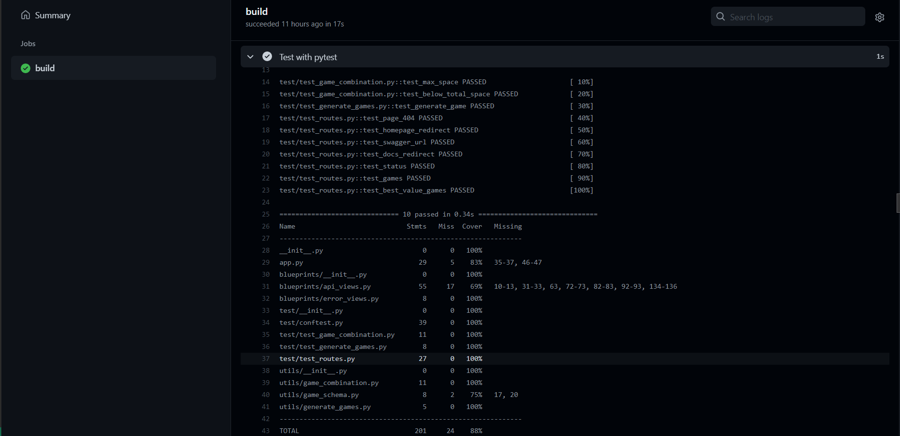
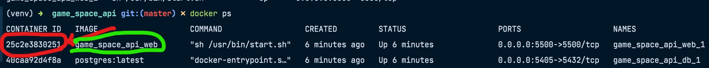
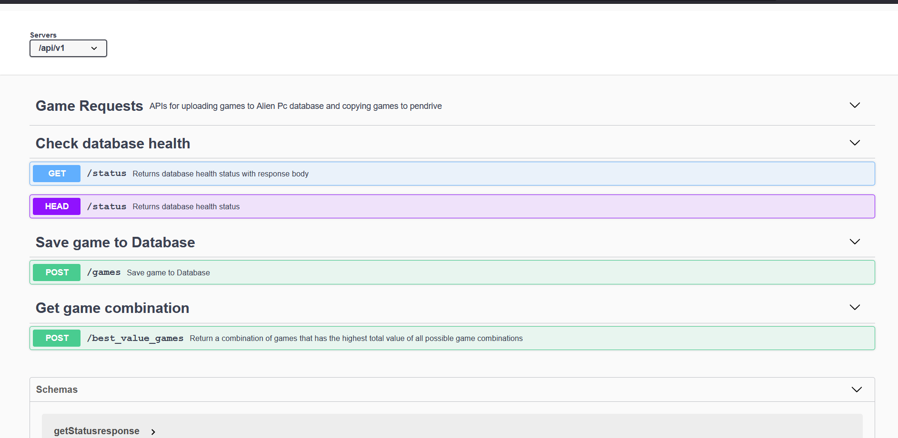

# GAME SPACE API

### Game space API allows you to do the following:

- [x] Check status of the database connection.

- [x] Upload game information to the database.

- [x] Return the best possible combination of games from the database that can fit into a hypothetical pen drive with a specified drive space in bytes. 


<!-- MarkdownTOC -->

- [Overview](#Overview)
- [Docker Prerequisites](#docker-prerequisites)
- [Dockerless Prerequisites](#dockerless-prerequisites)
- [Quickstart](#Quickstart)
- [Testing](#Testing)
- [Endpoints](#Endpoints)


<!-- /MarkdownTOC -->

# Overview

A service that returns the best possible combination of games from the database that can fit into a hypothetical pen drive with a specified drive space in bytes. It also has an endpoint for uploading new games to the database. 


## Built With

- [Python](https://www.python.org/)
- [Flask](https://flask.palletsprojects.com/en/2.0.x/)
- [PostgreSQL](https://www.postgresql.org/)
- [Docker](https://www.docker.com/)


# Docker Prerequisites

1. Clone this repository.

2. Docker installed on your operating system, for installation instructions, visit [here](https://docs.docker.com/get-docker/)

3. Set up `.env` file, all the necessary environment variables can be found in `.env.example`. It is necessary to note the following during env setup:

   * SET FLASK_ENV to 'development' OR 'production'

   * SET DATABASE_URL to postgres database uri e.g postgresql+psycopg2://[postgres user]:[postgres password]@db/[postgres name] where name, user and password is as specified in the docker-compose.yml file in the root directory.


# Dockerless Prerequisites

> If you choose to run this project without docker, please ensure the following requirements are met.

1. Python 3.8

2. Clone this repository.

3. Setup virtual environment. Visit [here](https://docs.python.org/3/library/venv.html) for a detailed guide on how to setup virtualenv.

4. Install the project requirements:
    ```sh
    $ pip3 install -r requirements.txt
    ```
5. Set up postgres database locally, for postgresql installation instructions please visit [here](https://www.postgresqltutorial.com/postgresql-getting-started/)

6. Set up `.env` file, all the necessary environment variables can be found in `.env.example`. It is necessary to note the following during env setup:
   * SET FLASK_ENV to 'development' OR 'production'

   * SET DATABASE_URL to postgres database uri e.g postgresql+psycopg2://[postgres user]:[postgres password]@db/[postgres name] where name, user and password are your database details.


# Quickstart

## Get started with docker

1. Open a command line terminal and navigate to the directory of the cloned repository.

2. You have to create a games table in the database on the first run of the application, this can be easily done by setting CREATE_TABLE with value "true" in the web enviroment section of the docker-compose.yml file.

3. Build  the docker image of the application using the command:

    ```sh
        $ docker-compose build
    ```

4. Run the application container using the command:

    ```sh
        $ docker-compose up 
    ```

5. For subsequent runs, to avoid having to re-create the games table on every run set CREATE_TABLE with value  "false" and run the below command to effect the new changes.

    ```sh
        $ docker-compose build 
     ```


## Get started without docker

1. Open a terminal and navigate to the directory of the cloned repository.

2. Create a games table by running the following command.

    ```sh
        $ python3 create_table.py
     ```

3. Run the application using the following command.

    ```sh
        $ flask run
     ```


# Testing

- Testing has been automated and is part of the github actions pipeline in .github/workflows/python-app.yml.  

- The tests and the test configurations can be found in test folder in the root directory.

### Test Result image
<details>
<summary></summary>



</details>


## To test locally with docker:

1. Run the application, skip this step if the application is already running.

    ```sh
        $ docker-compose up 
    ```

2. Check for running containers using the following command.

    ```sh
        $ docker ps 
    ```

3. Get the container-id as highlighted(red) in the picture below, the container name should be game_space_api_web(green).

    Container id image
    <details>
    <summary></summary>

    

    </details>


4. Open a shell in the container using the command below, where [container-id] is the container-id gotten in step 3.

    ```sh
        $ docker exec -it [container-id] bash -l 
    ```

5. Run the tests in the container shell using the command.

    ```sh
        $ coverage run -m pytest -vv --disable-warnings && coverage report --show-missing 
    ```


## To test locally without docker:

- Run the tests in your local terminal using the command.

    ```sh
        $ coverage run -m pytest -vv --disable-warnings && coverage report --show-missing 
    ```


# Endpoints

1. GET http://localhost:5000/docs/

    - HTML web page showing all the API endpoints. It uses OpenAPI specifications for documenting the APIs. It can also be used to test all the endpoints.

    - Docs Image:
        <details>
        <summary></summary>

        

        </details>


2. GET http://localhost:5000/api/v1/status

    - **Success** returns status code 200 when the database connection is healthy.

        ```json
        {
            "database": "healthy"
        }
        ```
    - **Failure** returns status code 502 when the database connection isn't healthy.
        ```json
        {
            "database": "unhealthy"
        }
        ```


3. HEAD http://localhost:5000/api/v1/status

    - **Success** returns status code 200 when the database connection is healthy

    - **Failure** returns status code 502 when the database connection isn't healthy


4. POST http://localhost:5000/api/v1/games

    - Has a request payload with the following schema and specifications.
        ```json
            {
                "name": "Diablo 112", // unique, not empty string
                "price": 71.7, // non-negative float
                "space": 1073741824 // positive (1 GB in bytes)
            }
        ```

    - Validates the payload and saves the game information into the DB

    - **Success** sample response payload:

        status code: 201 
        ```json
            {
                "name": "Diablo 112",
                "price": 71.7,
                "space": 1073741824 
            }
        ```

    - **Failure** sample response payload:

        status code: 400
        ```json
            {
            "data": {
                    "name": "Diablo 112",
                    "price": 100,
                    "space": -1222232
                    },
            "message": "Game space can only be a positive value",
            "status": "error"
            }
        ```

5. POST http://localhost:5000/api/v1/best_value_games?pen_drive_space={POSITIVE_INTEGER}

    - Validate pen_drive_space query parameter which must be a positive integer.

    - It returns a combination of games that has the highest total value of all possible game combinations 
     that fits given pen-drive space

    - **Success** sample response payload:

        status code: 200
        ```json
            {
                "games": [
                {
                    "name": "Super Game",
                    "price": 71.7,
                    "space": 1073741824
                },
                {
                    "name": "Extra Game",
                    "price": 100.78,
                    "space": 2147483648
                }
                ],
                "total_space": 3221225472, // total space of games
                "remaining_space": 1024 // empty space on the pen-drive after download
                "total_value": 172.48 // float
            }
        ```

    - **Failure** sample response payload:

        status code: 400
        ```json
            {
            "message": "Pen drive space of -307374182 bytes is not a positive integer",
            "status": "error"
            }
        ```   

    
   
